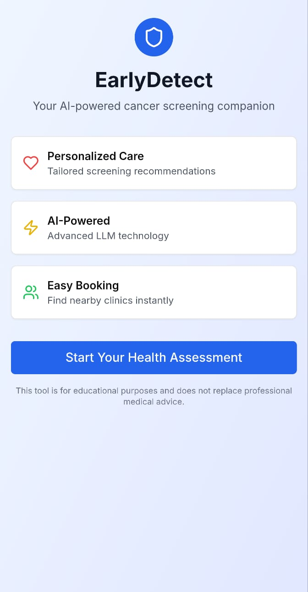

# EarlyDetect - Empowering Cancer Screening Uptake through AI-Driven Digital Assistance

### View the live project at: https://v0-early-detect-prototype.vercel.app/

## Overview

EarlyDetect is an innovative mobile web application that empowers cancer screening uptake through an LLM-driven digital assistant. Built for a hackathon, this prototype demonstrates how artificial intelligence can be leveraged to provide personalized cancer screening recommendations and improve healthcare accessibility.

## Purpose

Cancer screening is crucial for early detection and improved health outcomes, yet many individuals delay or avoid necessary screenings due to lack of awareness, anxiety, or uncertainty about which screenings are appropriate for their risk profile. EarlyDetect addresses these challenges by:

- **Personalizing Recommendations**: Using comprehensive health data to provide tailored cancer screening suggestions
- **Reducing Barriers**: Offering an accessible, mobile-first interface that guides users through the screening process
- **Improving Engagement**: Providing AI-powered conversations with customizable personalities to match user preferences
- **Streamlining Booking**: Connecting users directly with nearby healthcare providers for seamless appointment scheduling
- **Continuing Care**: Offering personalized health resources and follow-up recommendations

## Features

### 🔍 Comprehensive Health Assessment
- Multi-step questionnaire collecting demographics, medical history, family history, and lifestyle factors
- Integration-ready for Singapore's Electronic Health Record system
- Mobile-optimized form with intuitive controls (including age slider)

### 🤖 AI-Powered Personalized Assistant
- LLM-driven chat interface using OpenAI GPT-4
- Four distinct AI personalities: Analytical, Empathetic, Enthusiastic, and Professional
- Contextual recommendations based on individual risk factors and health profile

### 📅 Smart Appointment Booking
- Integration with Singapore healthcare providers
- Location-based clinic recommendations
- Pre-filled booking forms with AI-suggested optimal screening types and timing

### 📚 Personalized Health Resources
- Curated health articles based on user's screening recommendations
- Next-step guidance for maintaining health between screenings
- Educational content tailored to individual risk factors

## Technology Stack

- **Frontend**: Next.js 14 with App Router, React, TypeScript
- **Styling**: Tailwind CSS with shadcn/ui components
- **AI Integration**: Vercel AI SDK with OpenAI GPT-4
- **State Management**: React hooks with localStorage for data persistence
- **Mobile-First**: Responsive design optimized for mobile devices

## Getting Started

### Prerequisites
- Node.js 18+ and pnpm
- OpenAI API key

### Installation

1. Clone the repository:
\`\`\`bash
git clone https://github.com/your-username/earlydetect-prototype.git
cd earlydetect-prototype
\`\`\`

2. Install dependencies:
\`\`\`bash
pnpm install
\`\`\`

3. Set up environment variables:
\`\`\`bash
cp .env.example .env.local
\`\`\`

Add your OpenAI API key to `.env.local`:
\`\`\`
OPENAI_API_KEY=your_openai_api_key_here
\`\`\`

4. Run the development server:
\`\`\`bash
pnpm dev
\`\`\`

5. Open [http://localhost:3000](http://localhost:3000) in your browser.

## User Journey

1. **Welcome & Introduction** - Users learn about EarlyDetect's capabilities
2. **Health Assessment** - Comprehensive 4-step questionnaire covering:
   - Personal demographics
   - Medical history and current conditions
   - Family cancer history
   - Lifestyle and behavioral factors
3. **AI Personality Selection** - Choose preferred interaction style
4. **AI Consultation** - Chat with personalized AI assistant for screening recommendations
5. **Appointment Booking** - Schedule screenings at nearby Singapore clinics
6. **Personalized Resources** - Access tailored health articles and next steps

## Project Structure

\`\`\`
├── app/ 
│   ├── api/chat/          # AI chat API endpoint
│   ├── questionnaire/     # Multi-step health assessment
│   ├── personality/       # AI personality selection
│   ├── chat/             # AI consultation interface
│   ├── booking/          # Appointment scheduling
│   └── recommendations/  # Personalized health resources
├── components/ui/        # Reusable UI components
└── lib/                 # Utility functions
\`\`\`

## Future Enhancements

- Integration with real Singapore healthcare provider APIs
- User authentication and profile management
- SMS/Email appointment reminders
- Advanced risk assessment algorithms
- Multi-language support (English, Mandarin, Malay, Tamil)
- Telehealth consultation booking
- Health tracking and progress monitoring

## Project Authors

- **Nihal Deb** - Full-stack development
- **Nicholas Ngan** - AI integration
- **Gary Ang** - Healthcare domain expertise

## Disclaimer

This application is designed for educational and demonstration purposes. It does not replace professional medical advice, diagnosis, or treatment. Users should always consult with qualified healthcare providers for medical decisions.

## License

This project is licensed under the MIT License - see the [LICENSE](LICENSE) file for details.

## Acknowledgments

- Built for the Sahlgrenska Global Health Hackathon
- Inspired by Singapore's national cancer screening programs
- Powered by OpenAI's GPT-4 and Vercel's AI SDK
- UI components from shadcn/ui

---
\`\`\`
